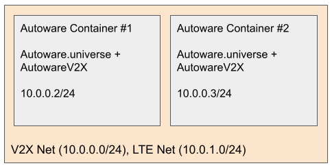

# Running AutowareV2X in the Planning Simulator

Simulations can be an easy way of verifying the functionality of AutowareV2X before an actual field test.
We will use [Autoware's Planning Simulator](https://autowarefoundation.github.io/autoware-documentation/main/tutorials/ad-hoc-simulation/planning-simulation/) here and add connectivity to it with AutowareV2X.

!!! Note
    Make sure you have completed [Autoware's Planning Simulator Tutorial](https://autowarefoundation.github.io/autoware-documentation/main/tutorials/ad-hoc-simulation/planning-simulation/) before continuing.

Here, since we want to test both the sending and receiving of information through AutowareV2X, we will need at least two AutowareV2X instances. For this, we will use a Docker-based environment.

## The Docker environment to create

We will be creating the Docker environment as depicted in the figure below. There will be two Docker containers, each of which includes Autoware.universe and AutowareV2X. They will both be a part of the Docker network called `v2x_net` with the subnet `10.0.0.0/24`.



### Create a Docker network for V2X communication

```bash
docker network create --driver=bridge --subnet=10.0.0.0/24 v2x_net -o com.docker.network.bridge.name="v2x_net"
```


### Launch two Autoware containers

```bash
# In one terminal, use rocker to launch container "autoware_1"
rocker --nvidia --x11 --user --volume $HOME/autoware_docker --volume $HOME/autoware_map --network=v2x_net --ip 10.0.0.2 --name autoware_1 --hostname autoware_1 -- ghcr.io/autowarefoundation/autoware-universe:latest-cuda

# In another terminal, use rocker to launch container "autoware_2"
rocker --nvidia --x11 --user --volume $HOME/autoware_docker --volume $HOME/autoware_map --network=v2x_net --ip 10.0.0.3 --name autoware_2 --hostname autoware_2 -- ghcr.io/autowarefoundation/autoware-universe:latest-cuda
```

## Run Planning Simulator

Run the Planning Simulator in both `autoware_1` and `autoware_2`.

```
source ~/autoware_docker/install/setup.bash
ros2 launch autoware_launch planning_simulator.launch.xml map_path:=$HOME/autoware_map/sample-map-planning vehicle_model:=sample_vehicle sensor_model:=sample_sensor_kit
```


## Run AutowareV2X

In another terminal, connect to the `autoware_1` and `autoware_2` containers, and start AutowareV2X in both of them.

```
source ~/autoware_docker/install/setup.bash
ros2 launch autoware_v2x v2x.launch.xml network_interface:=eth1
```